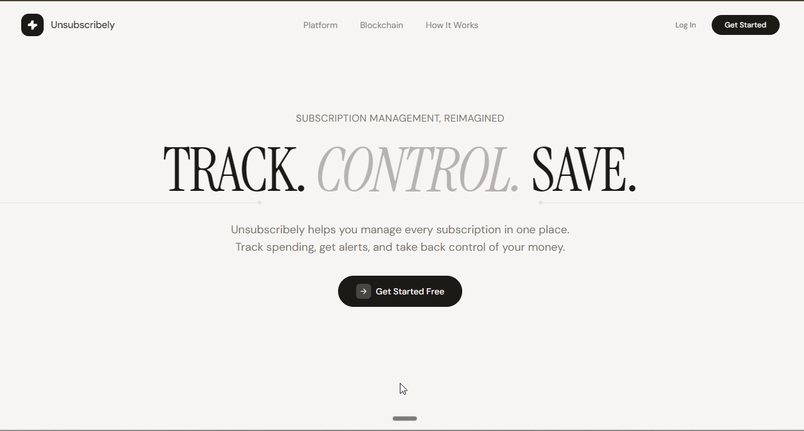
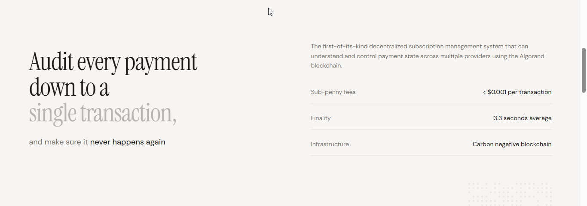
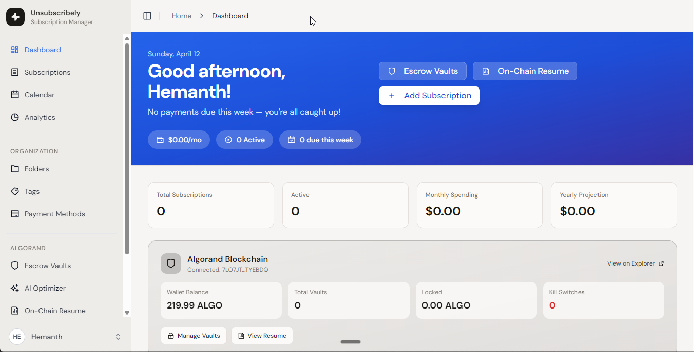
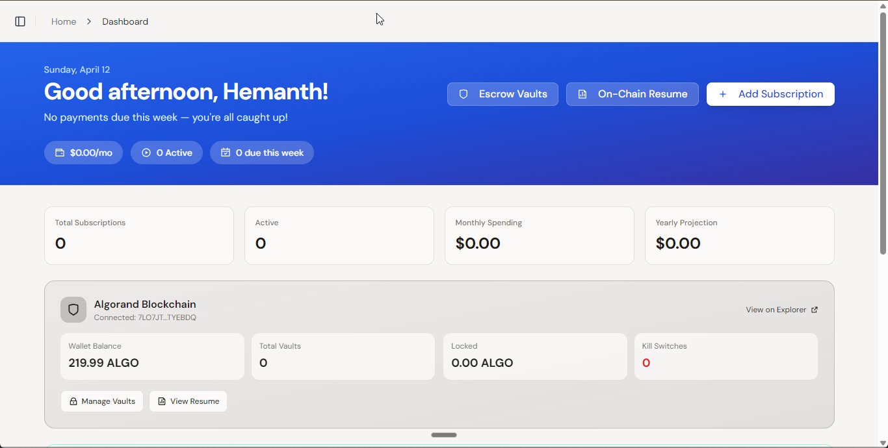

<!-- back to top anchor -->
<a id="readme-top"></a>

<!-- PROJECT SHIELDS -->
[![Contributors][contributors-shield]][contributors-url]
[![Forks][forks-shield]][forks-url]
[![Stargazers][stars-shield]][stars-url]
[![Issues][issues-shield]][issues-url]
[![License][license-shield]][license-url]
[![LinkedIn][linkedin-shield]][linkedin-url]

<!-- PROJECT LOGO -->
<br />
<div align="center">
  <a href="https://unsubly2.vercel.app">
    
  </a>

  <h3 align="center">Unsubscribely</h3>

  <p align="center">
    Subscription management, built on the Algorand blockchain.
    <br />
    <a href="https://unsubly2.vercel.app"><strong>Explore the live app »</strong></a>
    <br />
    <br />
    <a href="https://unsubly2.vercel.app">View Demo</a>
    &middot;
    <a href="https://github.com/devndesigner6/unsubly/issues/new?labels=bug">Report Bug</a>
    &middot;
    <a href="https://github.com/devndesigner6/unsubly/issues/new?labels=enhancement">Request Feature</a>
  </p>
</div>

<!-- TABLE OF CONTENTS -->
<details>
  <summary>Table of Contents</summary>
  <ol>
    <li>
      <a href="#about-the-project">About The Project</a>
      <ul>
        <li><a href="#built-with">Built With</a></li>
      </ul>
    </li>
    <li>
      <a href="#getting-started">Getting Started</a>
      <ul>
        <li><a href="#prerequisites">Prerequisites</a></li>
        <li><a href="#installation">Installation</a></li>
      </ul>
    </li>
    <li><a href="#usage">Usage</a></li>
    <li><a href="#roadmap">Roadmap</a></li>
    <li><a href="#contributing">Contributing</a></li>
    <li><a href="#license">License</a></li>
    <li><a href="#contact">Contact</a></li>
    <li><a href="#acknowledgments">Acknowledgments</a></li>
  </ol>
</details>

<!-- ABOUT THE PROJECT -->
## About The Project

<table>
  <tr>
    <td></td>
    <td></td>
  </tr>
  <tr>
    <td></td>
    <td></td>
  </tr>
</table>

Most subscription trackers are just spreadsheets with a nicer font. They show you what you spend, but they cannot do anything about it. Unsubscribely puts your subscriptions on-chain. You lock funds in an escrow vault, and an autonomous agent releases payments on billing date without you lifting a finger. Every payment is a transaction you can verify on Algorand. Every release mints an ARC-3 NFT as a receipt.

Here is why this is different:
* Funds sit in a smart contract you control, not in someone else's account
* An AI agent watches your billing dates and releases vaults automatically
* You can kill any vault at any time and get your ALGO back instantly
* Every payment is immutable, on-chain, and auditable forever

The project was built for AlgoBharat Hack Series 3.0, targeting the Agentic Commerce track, specifically the A2A Autonomous Payments category.

<p align="right">(<a href="#readme-top">back to top</a>)</p>

### Built With

* [![TypeScript][TypeScript-shield]][TypeScript-url]
* [![React][React-shield]][React-url]
* [![Vite][Vite-shield]][Vite-url]
* [![TailwindCSS][Tailwind-shield]][Tailwind-url]
* [![Algorand][Algorand-shield]][Algorand-url]
* [![AlgoKit][AlgoKit-shield]][AlgoKit-url]
* [![Supabase][Supabase-shield]][Supabase-url]
* [![Vercel][Vercel-shield]][Vercel-url]

<p align="right">(<a href="#readme-top">back to top</a>)</p>

<!-- GETTING STARTED -->
## Getting Started

To get a local copy up and running, follow these steps.

### Prerequisites

* Node.js 20 or later
* Python 3.12 or later with AlgoKit installed
  ```sh
  pip install algokit
  ```
* A Supabase project with the schema applied
* Pera Wallet on Algorand Testnet with some test ALGO

### Installation

1. Clone the repo
   ```sh
   git clone https://github.com/devndesigner6/unsubly.git
   cd unsubly
   ```
2. Install dependencies
   ```sh
   npm install
   ```
3. Create a `.env` file at the root
   ```env
   VITE_SUPABASE_URL=your_supabase_url
   VITE_SUPABASE_PUBLISHABLE_KEY=your_supabase_anon_key
   AGENT_WALLET_MNEMONIC=your_25_word_algorand_mnemonic
   ```
4. Start the dev server
   ```sh
   npm run dev
   ```
5. To recompile smart contracts (optional, pre-compiled artifacts are included)
   ```sh
   algokit compile py smart_contracts/
   ```

<p align="right">(<a href="#readme-top">back to top</a>)</p>

<!-- USAGE EXAMPLES -->
## Usage

1. Sign up at [unsubly2.vercel.app](https://unsubly2.vercel.app). No credit card, no trial, completely free.
2. Connect your Pera Wallet from the dashboard.
3. Add a subscription manually or import a spreadsheet via CSV.
4. Open Escrow Vaults, pick a vault type, and fund it with ALGO. Pera Wallet will ask you to sign two transactions: one to deploy the contract, one to fund it.
5. The autonomous agent runs every day. When a billing date hits, it calls `release()` on the vault contract and the funds go to the recipient on-chain. No click from you needed.
6. After release, open the vault details page and mint an ARC-3 NFT receipt. This is a permanent record on Algorand that proves the payment happened.
7. Use the AI Optimizer to see which subscriptions are costing the most relative to how much you use them.

For a full walkthrough with transaction screenshots, see the [live demo](https://unsubly2.vercel.app).

<p align="right">(<a href="#readme-top">back to top</a>)</p>

<!-- ROADMAP -->
## Roadmap

- [x] Five escrow vault types: Standard, Time-Lock, Multi-Sig, Dispute, ASA
- [x] A2A autonomous agent via GitHub Actions daily cron
- [x] ARC-3 NFT payment receipts
- [x] ARC-4 ABI compliant contracts compiled to TEAL v11
- [x] AI spending optimizer
- [x] On-chain payment resume
- [x] Kill switch on every vault
- [x] Lora Explorer links on every transaction
- [ ] Mainnet deployment
- [ ] Mobile app using Expo
- [ ] Multi-wallet support for Defly and Lute
- [ ] Recurring ASA token payment automation
- [ ] DAO-based arbitration for dispute vaults

See the [open issues](https://github.com/devndesigner6/unsubly/issues) for the full list of proposed features and known issues.

<p align="right">(<a href="#readme-top">back to top</a>)</p>

<!-- CONTRIBUTING -->
## Contributing

Contributions are what make the open source community such an amazing place to learn, inspire, and create. Any contributions you make are greatly appreciated.

If you have a suggestion that would make this better, please fork the repo and create a pull request. You can also open an issue with the tag "enhancement". Do not forget to give the project a star.

1. Fork the project
2. Create your feature branch (`git checkout -b feature/AmazingFeature`)
3. Commit your changes (`git commit -m 'Add some AmazingFeature'`)
4. Push to the branch (`git push origin feature/AmazingFeature`)
5. Open a pull request

### Top contributors

<a href="https://github.com/devndesigner6/unsubly/graphs/contributors">
  
</a>

<p align="right">(<a href="#readme-top">back to top</a>)</p>

<!-- LICENSE -->
## License

Distributed under the Apache License 2.0. See `LICENSE` for more information.

<p align="right">(<a href="#readme-top">back to top</a>)</p>

<!-- CONTACT -->
## Contact

Hemanth Peddada - [@hemanttbuilds](https://x.com/hemanttbuilds) - peddadahemanth6@gmail.com

Website: [hemanthme.in](https://hemanthme.in)

GitHub: [@devndesigner6](https://github.com/devndesigner6)

Project Link: [https://github.com/devndesigner6/unsubly](https://github.com/devndesigner6/unsubly)

<p align="right">(<a href="#readme-top">back to top</a>)</p>

<!-- ACKNOWLEDGMENTS -->
## Acknowledgments

* [Algorand Foundation](https://algorand.foundation)
* [AlgoKit](https://github.com/algorandfoundation/algokit-cli)
* [Pera Wallet](https://perawallet.app)
* [AlgoNode](https://algonode.io)
* [Lora Explorer](https://lora.algokit.io)
* [Supabase](https://supabase.com)
* [shadcn/ui](https://ui.shadcn.com)
* [Remix Icons](https://remixicon.com)
* [othneildrew/Best-README-Template](https://github.com/othneildrew/Best-README-Template)
* [Img Shields](https://shields.io)

<p align="right">(<a href="#readme-top">back to top</a>)</p>

<!-- MARKDOWN LINKS & IMAGES -->
[contributors-shield]: https://img.shields.io/github/contributors/devndesigner6/unsubly.svg?style=for-the-badge
[contributors-url]: https://github.com/devndesigner6/unsubly/graphs/contributors
[forks-shield]: https://img.shields.io/github/forks/devndesigner6/unsubly.svg?style=for-the-badge
[forks-url]: https://github.com/devndesigner6/unsubly/network/members
[stars-shield]: https://img.shields.io/github/stars/devndesigner6/unsubly.svg?style=for-the-badge
[stars-url]: https://github.com/devndesigner6/unsubly/stargazers
[issues-shield]: https://img.shields.io/github/issues/devndesigner6/unsubly.svg?style=for-the-badge
[issues-url]: https://github.com/devndesigner6/unsubly/issues
[license-shield]: https://img.shields.io/github/license/devndesigner6/unsubly.svg?style=for-the-badge
[license-url]: https://github.com/devndesigner6/unsubly/blob/main/LICENSE
[linkedin-shield]: https://img.shields.io/badge/-LinkedIn-black.svg?style=for-the-badge&logo=linkedin&colorB=555
[linkedin-url]: https://linkedin.com/in/hemanthp15gr6

[TypeScript-shield]: https://img.shields.io/badge/TypeScript-3178C6?style=for-the-badge&logo=typescript&logoColor=white
[TypeScript-url]: https://www.typescriptlang.org
[React-shield]: https://img.shields.io/badge/React-20232A?style=for-the-badge&logo=react&logoColor=61DAFB
[React-url]: https://react.dev
[Vite-shield]: https://img.shields.io/badge/Vite-646CFF?style=for-the-badge&logo=vite&logoColor=white
[Vite-url]: https://vite.dev
[Tailwind-shield]: https://img.shields.io/badge/TailwindCSS-06B6D4?style=for-the-badge&logo=tailwindcss&logoColor=white
[Tailwind-url]: https://tailwindcss.com
[Algorand-shield]: https://img.shields.io/badge/Algorand-000000?style=for-the-badge&logo=algorand&logoColor=white
[Algorand-url]: https://algorand.com
[AlgoKit-shield]: https://img.shields.io/badge/AlgoKit-v2-00A97F?style=for-the-badge&logo=algorand&logoColor=white
[AlgoKit-url]: https://github.com/algorandfoundation/algokit-cli
[Supabase-shield]: https://img.shields.io/badge/Supabase-3ECF8E?style=for-the-badge&logo=supabase&logoColor=white
[Supabase-url]: https://supabase.com
[Vercel-shield]: https://img.shields.io/badge/Vercel-000000?style=for-the-badge&logo=vercel&logoColor=white
[Vercel-url]: https://unsubly2.vercel.app
